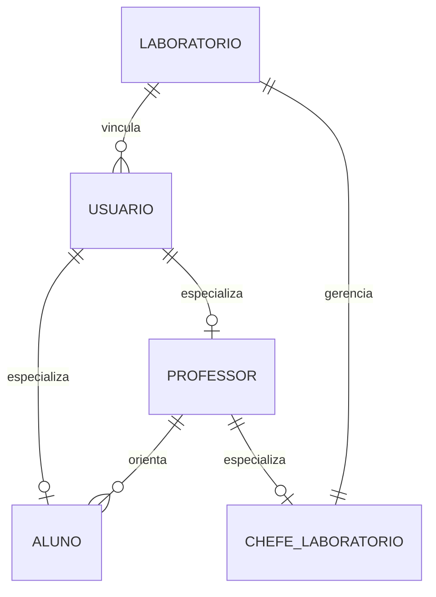
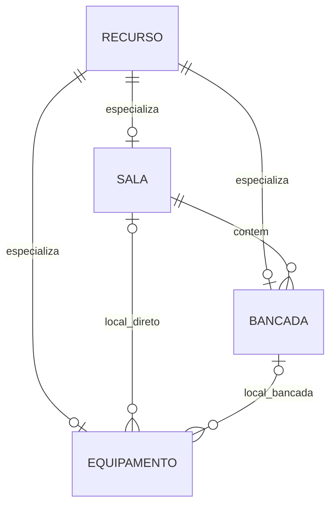
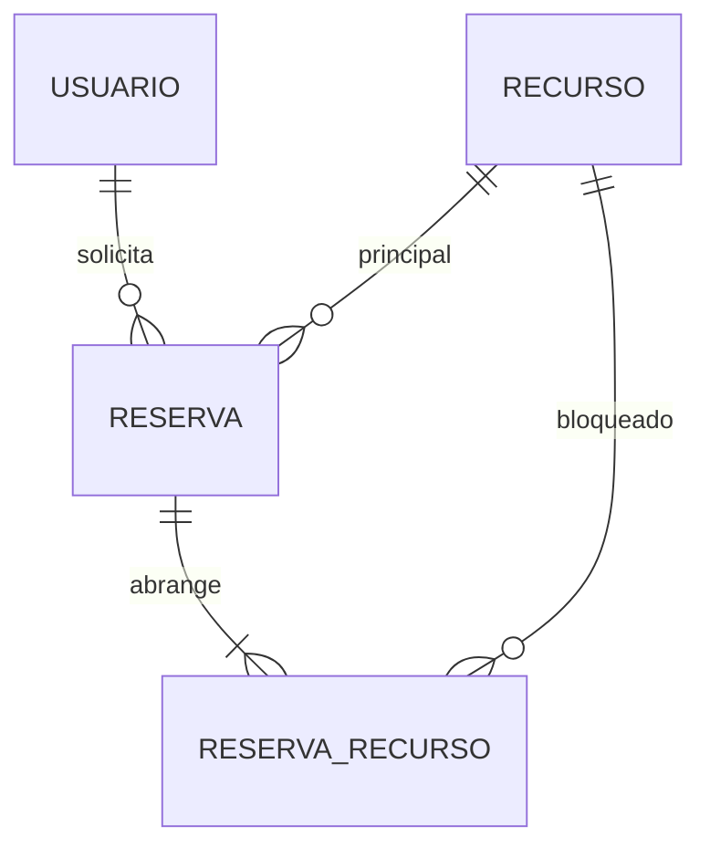
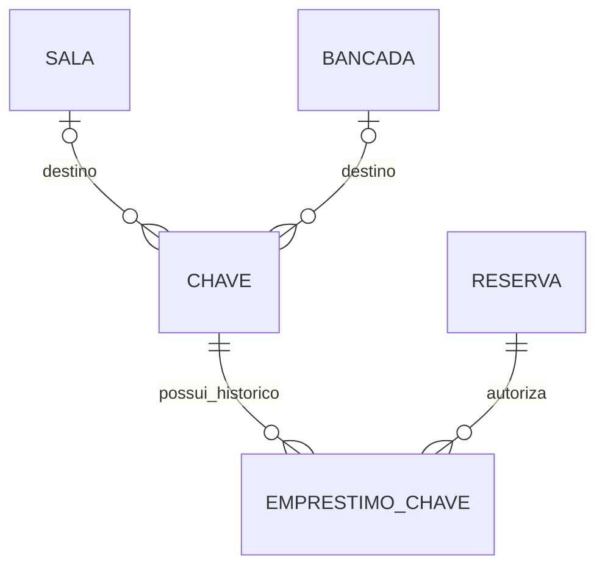

# Modelo relacional do banco implementado

Banco `gestao_laboratorio`, esquema `gestao_lab`, revisão de 04/10/2026. Os diagramas mostram cardinalidades por associação; a exclusividade entre subclasses e entre alternativas de localização é imposta por restrições e triggers. O dicionário acompanha os nomes e tipos reais do esquema.

## Usuários e laboratório

Cada usuário deve ser Aluno **ou** Professor. Chefe é Professor. O laboratório tem exatamente um Chefe registrado. O orientador e as demais relações preservam o laboratório. `sessao_usuario` referencia um usuário e guarda validade, revogação e resumo do token.

## Recursos e localização

Cada recurso tem exatamente uma subclasse compatível com seu `tipo`. Equipamento tem exatamente um local entre `bancada_id` e `sala_direta_id`. A sala do equipamento de bancada é derivada de `bancada.sala_id`; não se duplica esse vínculo no equipamento. `complemento_local` fornece a posição exata, e `numero_patrimonio` identifica globalmente a unidade física. Todos os recursos possuem laboratório e Professor responsável na base `recurso`.

## Reservas e abrangência

Uma reserva tem um recurso principal e um ou mais itens abrangidos. Cada item repete período e indicador de bloqueio para permitir o índice GiST; uma FK composta sincroniza esses valores com a reserva. Cancelamento atualiza o bloqueio por cascata de **atualização**, sem apagar histórico. O snapshot `local_registrado` preserva a posição do recurso na confirmação.

| Recurso principal | Itens materializados |
|---|---|
| Equipamento | A unidade selecionada. |
| Bancada | Bancada + todos os equipamentos vinculados. |
| Sala | Sala + todas as bancadas + equipamentos diretos e das bancadas. |

O conflito exige mesmo recurso abrangido e sobreposição dos períodos. Assim, dois microscópios da mesma bancada podem ser reservados individualmente, mas qualquer um deles impede a reserva integral da bancada e da sala no mesmo período.

## Cópias e empréstimos de chave

Cada cópia tem exatamente um destino entre Sala e Bancada. O empréstimo possui usuário, reserva, retirada, entrega, devolução e recebimento. Um índice parcial permite no máximo um empréstimo aberto por cópia. A condição física da cópia é separada da posse: a view deriva `EM_USO`, e ocorrências registram extravio ou indisponibilidade. Cancelamento/fim de reserva preservam o empréstimo aberto.

## Tabelas e correspondência com os requisitos

| Tabela | Finalidade | Requisitos |
|---|---|---|
| `laboratorio` | Nome, local, Chefe, limites e antecedência de validade. | RF03, RF18 |
| `usuario` | Identidade, e-mail, hash de senha e vínculo. | RF01, RF02 |
| `professor` | Programa de pós e ramal. | RF02 |
| `aluno` | Matrícula, tipo e orientador. | RF02 |
| `chefe_laboratorio` | Especialização do Professor e chefia. | RF02, RF03 |
| `sessao_usuario` | Persistência de sessões e resumo dos tokens. | RF01, RNF01 |
| `recurso` | Base de Sala, Bancada e Equipamento, estado e responsável. | RF04, RF15 |
| `sala` | Identificação, localização e capacidade. | RF04, RF25 |
| `bancada` | Sala obrigatória e identificação dentro da sala. | RF04, RF25 |
| `equipamento` | Patrimônio único, posição exclusiva, foto e complemento. | RF04, RF25 |
| `reserva` | Dono, principal, período, confirmação e cancelamento. | RF05, RF06, RF18, RF24 |
| `reserva_recurso` | Conjunto bloqueado, período sincronizado e local histórico. | RF05, RF24, RNF13 |
| `chave` | Cópia física, destino, condição e designação. | RF21 |
| `emprestimo_chave` | Retirada/devolução, portador e responsáveis. | RF22, RF23 |
| `ocorrencia_chave` | Condição física e ocorrências de cada cópia. | RF23 |
| `item_estoque` | Nome, lote, unidade, saldo, validade e limite. | RF07, RF08 |
| `movimentacao_estoque` | Variação, saldos anterior/posterior, motivo e ator. | RF07, RF17 |
| `protocolo` | Autor, PDF original, assinatura e validação. | RF09, RF10, RF12 |
| `protocolo_equipamento` | Associação de protocolo validado a equipamentos. | RF11 |
| `proibicao_aluno_equipamento` | Restrição ativa/histórica com motivo. | RF13 |
| `solicitacao_reativacao` | Justificativa, decisão e resposta do Chefe. | RF14 |
| `ocorrencia` | Relato de dano, falta de estoque ou outro problema. | RF16 |
| `notificacao` | Mensagem no sino, destinatário, leitura e deduplicação. | RF06, RF08, RF14, RF16, RF19 |
| `envio_email` | Fila, tentativas, envio, falha e reenvio. | RF19 |
| `historico_uso` | Auditoria de cadastros e operações. | RF17, RNF07 |
| `schema_versao` | Identificação da instalação do modelo. | RNF05 |

RF20/PWA usa os mesmos dados; sua implementação pertence ao frontend. RF26/agente especialista aguarda definição funcional e receberá migração específica. O quadro indica suporte de persistência; autenticação web, envio real de e-mail, tarefas periódicas e telas serão integrados nos próximos incrementos.

## Integridade entre laboratórios

`laboratorio_id` aparece nas bases e nas tabelas dependentes para permitir FKs compostas. Por exemplo, `(bancada_id, laboratorio_id)` referencia a bancada no mesmo laboratório, e `(orientador_usuario_id, laboratorio_id)` referencia o Professor correto. Essa repetição controlada permite ao próprio PostgreSQL rejeitar um vínculo entre laboratórios.

Os subtipos compartilham a chave da base, sem usar `INHERITS` do PostgreSQL. Tabelas abstratas são completas ao COMMIT; as verificações adiadas permitem gravar base e subtipo juntos. Não há exclusão de histórico em cascata. As FKs de reservas e empréstimos preservam os registros a que se referem.
